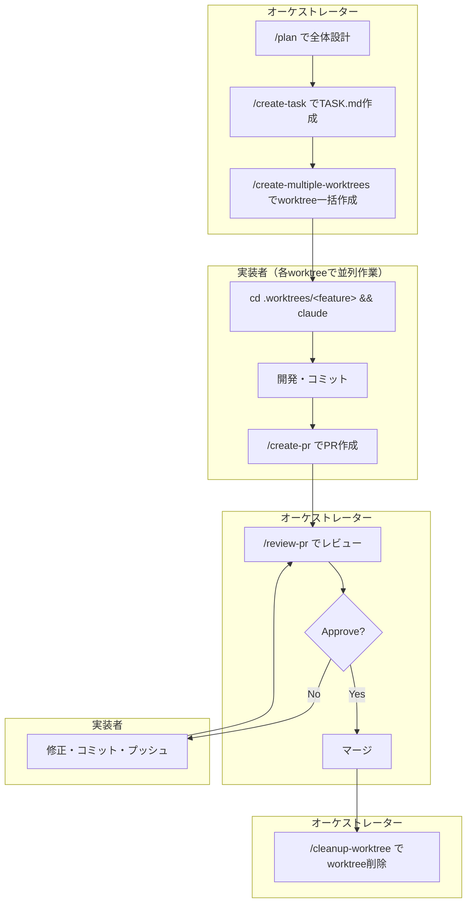
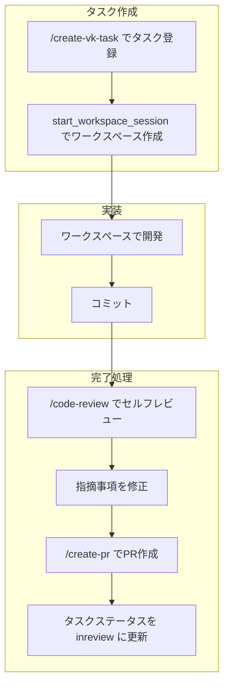

# Claude Code Skill Example

Claude Codeで設計からタスク管理、並列開発、PR作成までを効率化するスキルセットです。

## スキル一覧

| スキル | 説明 |
|--------|------|
| [create-task](./.claude/skills/create-task/SKILL.md) | ユーザーの説明を元にTASK.mdを生成 |
| [create-vk-task](./.claude/skills/create-vk-task/SKILL.md) | vibe-kanban MCPでタスクを登録 |
| [create-multiple-worktrees](./.claude/skills/create-multiple-worktrees/SKILL.md) | TASK.mdから複数のworktreeを一括作成 |
| [create-worktree](./.claude/skills/create-worktree/SKILL.md) | 単一のworktreeを作成 |
| [create-pr](./.claude/skills/create-pr/SKILL.md) | PR作成 |
| [cleanup-worktree](./.claude/skills/cleanup-worktree/SKILL.md) | worktree削除（PRマージ後に使用） |
| [review-pr](./.claude/skills/review-pr/SKILL.md) | GitHub PRをレビューしてコメント投稿 |

## ワークフロー

2つのワークフローに対応しています：

### A. ファイルベース（TASK.md + worktree）

従来のworktreeを使用した並列開発フロー。

```
/create-task → TASK.md作成
      ↓
/create-multiple-worktrees → worktree一括作成
      ↓
各worktreeで開発 → /create-pr → PRレビュー → /cleanup-worktree
```

### B. vibe-kanban連携（MCP + ワークスペース）

vibe-kanban MCPサーバーを使用したタスク管理フロー。

```
/create-vk-task → タスク登録（MCP経由）
      ↓
start_workspace_session → ワークスペース作成（自動でworktree + ブランチ作成）
      ↓
開発 → /code-review → /create-pr → タスクステータス更新
```

---

## 役割と責務

| 役割 | 責務 |
|------|------|
| **オーケストレーター** | 設計・タスク分割・ワークスペース作成・レビュー・クリーンアップ |
| **実装者** | ワークスペース内での開発・PR作成 |

---

## ワークフロー詳細

### A. ファイルベースワークフロー



### B. vibe-kanban連携ワークフロー



---

## 使い方

### ファイルベース（TASK.md + worktree）

#### 1. TASK.md作成

```bash
/create-task user-auth
# → ユーザーがタスク内容を説明
# → Claude Codeが要件・品質基準を含むTASK.mdを生成
# → tasks/user-auth.md として保存
```

#### 2. Worktree一括作成

```bash
/create-multiple-worktrees tasks/*.md
# または
/create-multiple-worktrees tasks/user-auth.md tasks/dashboard.md
```

#### 3. 開発・PR作成

```bash
cd .worktrees/user-auth && claude
# 開発後
/create-pr
```

#### 4. worktree削除（PRマージ後）

```bash
/cleanup-worktree
```

---

### vibe-kanban連携

#### 1. タスク登録

```bash
/create-vk-task user-auth
# → ユーザーがタスク内容を説明
# → Claude Codeがタスク説明を生成
# → vibe-kanban MCPでタスク登録
```

#### 2. ワークスペース作成

vibe-kanban MCPの `start_workspace_session` を実行すると：
- 自動でgit worktreeが作成される
- 専用ブランチ（`vk/<workspace-id>`）が作成される
- セットアップスクリプトが実行される（依存インストール等）

#### 3. 完了処理

タスク説明に記載された手順に従って：

```bash
# 1. セルフレビュー
/code-review

# 2. 指摘事項を修正

# 3. PR作成
/create-pr

# 4. タスクステータス更新（MCP経由）
```

---

### PRレビュー

```bash
# PR番号で指定
/review-pr 123

# URL形式でも可
/review-pr https://github.com/owner/repo/pull/123
```

レビュー後、Approve / Request Changes / Comment を選択してGitHubに投稿します。

---

## 他プロジェクトへの導入

### ディレクトリ構成

```
.claude/
├── skill-source/          ← submodule（このリポジトリ）
│   └── .claude/skills/
│       ├── create-pr/
│       ├── create-vk-task/
│       ├── review-pr/
│       └── ...
└── skills/                ← 実際に使用するスキル（コミット対象）
    ├── create-pr/         ← skill-sourceからコピー
    ├── create-vk-task/    ← skill-sourceからコピー
    ├── review-pr/         ← skill-sourceからコピー
    └── my-custom-skill/   ← プロジェクト固有のスキル
```

### 1. Submoduleとして追加

```bash
# skillsとして認識されない場所に配置
git submodule add https://github.com/boost-consulting/claude-code-skill-example-aibara .claude/skill-source
```

### 2. 必要なスキルをコピー

```bash
# 使いたいスキルを .claude/skills/ にコピー
cp -r .claude/skill-source/.claude/skills/create-pr .claude/skills/
cp -r .claude/skill-source/.claude/skills/create-vk-task .claude/skills/

# コミット
git add .claude/skills/
git commit -m "add skills from skill-source"
```

**ポイント:**
- `.claude/skill-source/` はスキルとして認識されない
- 使いたいスキルだけを `.claude/skills/` にコピー
- プロジェクト固有のスキルは `.claude/skills/` に直接配置可能

---

## スキル改善のフィードバック（PR手順）

他プロジェクトでスキルを改善した場合のPR手順。

### 1. skill-source内で編集・コミット

```bash
cd .claude/skill-source
git checkout -b improve/create-pr-enhancement

# ファイルを編集...

git add .
git commit -m "feat(create-pr): add support for draft PR"
```

### 2. PRを作成

```bash
git push origin improve/create-pr-enhancement
# GitHub上でPRを作成
```

### 3. マージ後、プロジェクトに同期

```bash
cd .claude/skill-source
git checkout main && git pull
cd ../..

# 更新されたスキルをコピー
cp -r .claude/skill-source/.claude/skills/create-pr .claude/skills/

git add .claude/skills/ .claude/skill-source
git commit -m "sync: update create-pr skill"
```

---

## リファレンス

このリポジトリは以下を元に作成されています：

- [shikajiro/claude-code-skill-example](https://github.com/shikajiro/claude-code-skill-example/tree/main)
