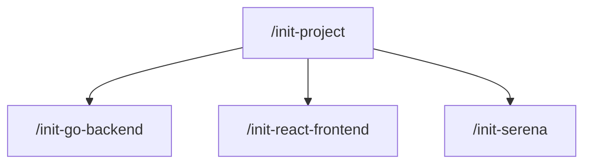
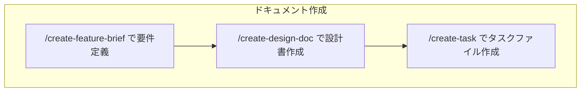
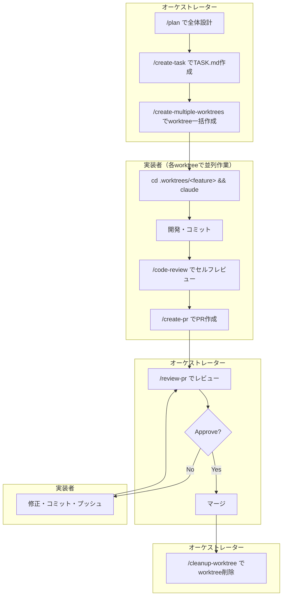
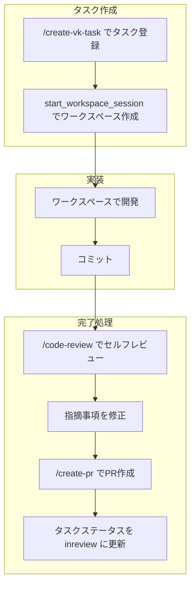

# Claude Code Skills

Claude Codeでプロジェクト立ち上げから設計・タスク管理・並列開発・PR作成までを効率化するスキルセットです。

## スキル一覧

### プロジェクト立ち上げ

新規プロジェクトの初期セットアップに使用するスキル（通常1回のみ実行）。

| スキル | 説明 |
|--------|------|
| [init-project](./.claude/skills/init-project/SKILL.md) | プロジェクト基盤（git, GitHub, mise, husky, dependabot, docs テンプレート） |
| [init-go-backend](./.claude/skills/init-go-backend/SKILL.md) | Go バックエンド（Clean Architecture, golangci-lint, depguard） |
| [init-react-frontend](./.claude/skills/init-react-frontend/SKILL.md) | React フロントエンド（Vite, TypeScript, ESLint, Prettier, dev proxy） |
| [init-serena](./.claude/skills/init-serena/SKILL.md) | Serena MCP（セマンティックコード操作） |

### 開発中

日常の開発サイクルで繰り返し使用するスキル。

#### ドキュメント作成

| スキル | 説明 |
|--------|------|
| [create-feature-brief](./.claude/skills/create-feature-brief/SKILL.md) | Feature Brief（要件定義）を生成 |
| [create-design-doc](./.claude/skills/create-design-doc/SKILL.md) | Design Doc（設計書）を生成 |

#### タスク管理

| スキル | 説明 |
|--------|------|
| [create-task](./.claude/skills/create-task/SKILL.md) | タスクファイル（TASK.md）を生成 |
| [create-vk-task](./.claude/skills/create-vk-task/SKILL.md) | vibe-kanban MCPでタスクを登録 |

#### Worktree 操作

| スキル | 説明 |
|--------|------|
| [create-worktree](./.claude/skills/create-worktree/SKILL.md) | 単一のworktreeを作成 |
| [create-multiple-worktrees](./.claude/skills/create-multiple-worktrees/SKILL.md) | TASK.mdから複数のworktreeを一括作成 |
| [cleanup-worktree](./.claude/skills/cleanup-worktree/SKILL.md) | worktree削除（PRマージ後に使用） |

#### PR / レビュー

| スキル | 説明 |
|--------|------|
| [create-pr](./.claude/skills/create-pr/SKILL.md) | PR作成 |
| [code-review](./.claude/skills/code-review/SKILL.md) | コードレビュー（セルフレビュー用） |
| [review-pr](./.claude/skills/review-pr/SKILL.md) | GitHub PRをレビューしてコメント投稿 |

---

## ワークフロー

### プロジェクト立ち上げフロー

新規プロジェクトを開始する際のフロー。技術スタックに応じて必要なスキルを実行する。

```
/init-project              ← 基盤作成（git, GitHub, tooling）
      ↓
/init-go-backend           ← Go バックエンド追加（任意）
      ↓
/init-react-frontend       ← React フロントエンド追加（任意）
      ↓
/init-serena               ← Serena MCP追加（任意）
```



### 開発フロー

#### ドキュメント作成フロー

Feature Brief → Design Doc → Task File の3層構造でドキュメントを管理する。

```
/create-feature-brief → docs/<name>-brief.md（なぜ・何を）
      ↓
/create-design-doc → docs/<name>-design.md（どうやって）
      ↓
/create-task → tasks/<name>.md（実装指示）
```



#### A. ファイルベースワークフロー

worktreeを使用した並列開発フロー。

```
/create-task → TASK.md作成
      ↓
/create-multiple-worktrees → worktree一括作成
      ↓
各worktreeで開発 → /code-review → /create-pr → /review-pr → /cleanup-worktree
```



#### B. vibe-kanban連携ワークフロー

vibe-kanban MCPサーバーを使用したタスク管理フロー。

```
/create-vk-task → タスク登録（MCP経由）
      ↓
start_workspace_session → ワークスペース作成（自動でworktree + ブランチ作成）
      ↓
開発 → /code-review → /create-pr → タスクステータス更新
```



---

## 役割と責務

| 役割 | 責務 |
|------|------|
| **オーケストレーター** | 設計・タスク分割・ワークスペース作成・レビュー・クリーンアップ |
| **実装者** | ワークスペース内での開発・PR作成 |

---

## 使い方

### プロジェクト立ち上げ

```bash
# 1. プロジェクト基盤
/init-project
# → git init, GitHub repo, mise.toml, docs/, husky, dependabot

# 2. Go バックエンド（必要な場合）
/init-go-backend
# → go.mod, Clean Architecture layers, golangci-lint

# 3. React フロントエンド（必要な場合）
/init-react-frontend
# → Vite + React + TypeScript, ESLint, Prettier, dev proxy

# 4. Serena MCP（必要な場合）
/init-serena
# → Serena MCP設定, .gitignore更新
```

### ドキュメント作成

```bash
# 1. Feature Brief 作成
/create-feature-brief user-auth
# → docs/user-auth-brief.md（なぜ・何を）

# 2. Design Doc 作成
/create-design-doc user-auth
# → docs/user-auth-design.md（どうやって）

# 3. タスクファイル作成
/create-task feature-user-auth
# → tasks/feature-user-auth.md（実装指示）
```

### ファイルベース開発

```bash
# 1. Worktree一括作成
/create-multiple-worktrees tasks/*.md

# 2. 開発・PR作成
cd .worktrees/feature-user-auth && claude
/code-review  # セルフレビュー
/create-pr    # PR作成

# 3. worktree削除（PRマージ後）
/cleanup-worktree
```

### vibe-kanban連携

```bash
# 1. タスク登録
/create-vk-task user-auth
# → vibe-kanban MCPでタスク登録

# 2. ワークスペース作成（MCP経由で自動）
# → worktree + ブランチが自動作成される

# 3. 完了処理
/code-review
/create-pr
# → タスクステータスを inreview に更新
```

### PRレビュー

```bash
/review-pr 123
# または
/review-pr https://github.com/owner/repo/pull/123
# → Approve / Request Changes / Comment を選択してGitHubに投稿
```

---

## 他プロジェクトへの導入

### ディレクトリ構成

```
.claude/
├── skill-source/          ← submodule（このリポジトリ）
│   └── .claude/skills/
│       ├── init-project/
│       ├── init-go-backend/
│       ├── create-pr/
│       └── ...
└── skills/                ← 実際に使用するスキル（コミット対象）
    ├── init-project/      ← skill-sourceからコピー
    ├── create-pr/         ← skill-sourceからコピー
    └── my-custom-skill/   ← プロジェクト固有のスキル
```

### 1. Submoduleとして追加

```bash
git submodule add https://github.com/boost-consulting/claude-code-skill-example-aibara .claude/skill-source
```

### 2. 必要なスキルをコピー

```bash
# 使いたいスキルを .claude/skills/ にコピー
cp -r .claude/skill-source/.claude/skills/init-project .claude/skills/
cp -r .claude/skill-source/.claude/skills/create-pr .claude/skills/

git add .claude/skills/
git commit -m "add skills from skill-source"
```

**ポイント:**
- `.claude/skill-source/` はスキルとして認識されない
- 使いたいスキルだけを `.claude/skills/` にコピー
- プロジェクト固有のスキルは `.claude/skills/` に直接配置可能

---

## スキル改善のフィードバック（PR手順）

他プロジェクトでスキルを改善した場合のPR手順。

### 1. skill-source内で編集・コミット

```bash
cd .claude/skill-source
git checkout -b improve/create-pr-enhancement
# ファイルを編集...
git add .
git commit -m "feat(create-pr): add support for draft PR"
```

### 2. PRを作成

```bash
git push origin improve/create-pr-enhancement
# GitHub上でPRを作成
```

### 3. マージ後、プロジェクトに同期

```bash
cd .claude/skill-source
git checkout main && git pull
cd ../..

cp -r .claude/skill-source/.claude/skills/create-pr .claude/skills/

git add .claude/skills/ .claude/skill-source
git commit -m "sync: update create-pr skill"
```

---

## リファレンス

このリポジトリは以下を元に作成されています：

- [shikajiro/claude-code-skill-example](https://github.com/shikajiro/claude-code-skill-example/tree/main)
