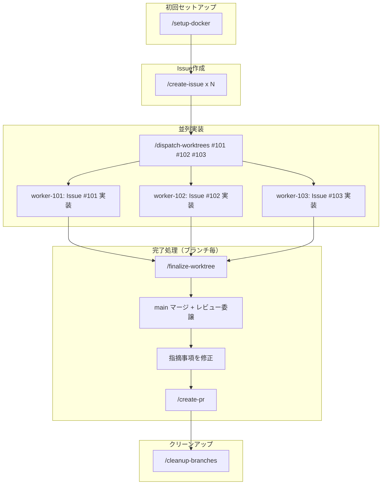

# Claude Code Skills

Claude Codeでプロジェクト立ち上げから設計・並列実装・レビュー・PR作成までを効率化するスキルセットです。

## スキル一覧

### プロジェクト立ち上げ

新規プロジェクトの初期セットアップに使用するスキル（通常1回のみ実行）。

| スキル | 説明 |
|--------|------|
| [init-project](./.claude/skills/init-project/SKILL.md) | プロジェクト基盤（git, GitHub, mise, husky, dependabot, docs テンプレート） |
| [init-go-backend](./.claude/skills/init-go-backend/SKILL.md) | Go バックエンド（Clean Architecture, golangci-lint, depguard） |
| [init-react-frontend](./.claude/skills/init-react-frontend/SKILL.md) | React フロントエンド（Vite, TypeScript, ESLint, Prettier, dev proxy） |
| [init-nextjs-frontend](./.claude/skills/init-nextjs-frontend/SKILL.md) | Next.js フロントエンド |
| [init-serena](./.claude/skills/init-serena/SKILL.md) | Serena MCP（セマンティックコード操作） |

### 開発中

日常の開発サイクルで繰り返し使用するスキル。

#### ドキュメント作成

| スキル | 説明 |
|--------|------|
| [create-feature-brief](./.claude/skills/create-feature-brief/SKILL.md) | Feature Brief（要件定義）を生成 |
| [create-design-doc](./.claude/skills/create-design-doc/SKILL.md) | Design Doc（設計書）を生成 |
| [create-issue](./.claude/skills/create-issue/SKILL.md) | GitHub Issueを作成（タスク定義・受け入れ基準） |

#### Docker + Agent Teams（並列実装）

| スキル | 説明 |
|--------|------|
| [setup-docker](./.claude/skills/setup-docker/SKILL.md) | Docker + Agent Teams 環境のセットアップ（Dockerfile, docker-compose, mise） |
| [dispatch-worktrees](./.claude/skills/dispatch-worktrees/SKILL.md) | GitHub Issueをもとにworktree作成 + Agent Teamsチームメイトを並列起動 |
| [finalize-worktree](./.claude/skills/finalize-worktree/SKILL.md) | mainマージ → コードレビュー委譲 → 修正 → PR作成 |
| [delegate-code-review](./.claude/skills/delegate-code-review/SKILL.md) | コードレビューをチームメイトに委譲（内部スキル） |
| [cleanup-branches](./.claude/skills/cleanup-branches/SKILL.md) | PRマージ後のブランチ・worktreeクリーンアップ |

#### PR / レビュー

| スキル | 説明 |
|--------|------|
| [create-pr](./.claude/skills/create-pr/SKILL.md) | PR作成（Issue番号をタイトル/本文に自動追加） |
| [code-review](./.claude/skills/code-review/SKILL.md) | コードレビュー（セルフレビュー / チームメイト委譲対応） |
| [review-pr](./.claude/skills/review-pr/SKILL.md) | GitHub PRをレビューしてコメント投稿（Issue受け入れ基準チェック対応） |

#### 共通

| スキル | 説明 |
|--------|------|
| [shared/REVIEW_CHECKLIST.md](./.claude/skills/shared/REVIEW_CHECKLIST.md) | 共通レビューチェックリスト（code-review / review-pr が参照） |
| [generate-review-checklist](./.claude/skills/generate-review-checklist/SKILL.md) | プロジェクト固有のレビューチェックリストを生成・更新 |

#### タスク管理（vibe-kanban連携）

vibe-kanban MCP を使用する場合のスキル。

| スキル | 説明 |
|--------|------|
| [[legacy]start-vk-task](./.claude/skills/%5Blegacy%5Dstart-vk-task/SKILL.md) | GitHub Issueをvibe-kanbanに登録してワークスペース開始 |
| [[legacy]start-pr-review-task](./.claude/skills/%5Blegacy%5Dstart-pr-review-task/SKILL.md) | PRレビュータスクをvibe-kanbanに登録して開始 |

---

## ワークフロー

### プロジェクト立ち上げフロー

新規プロジェクトを開始する際のフロー。技術スタックに応じて必要なスキルを実行する。

```
/init-project              <- 基盤作成（git, GitHub, tooling）
      |
/init-go-backend           <- Go バックエンド追加（任意）
      |
/init-react-frontend       <- React フロントエンド追加（任意）
      |
/init-serena               <- Serena MCP追加（任意）
```

### ドキュメント作成フロー

Feature Brief -> Design Doc -> GitHub Issue の構造でドキュメントを管理する。

```
/create-feature-brief -> docs/<name>-brief.md（なぜ・何を）
      |
/create-design-doc -> docs/<name>-design.md（どうやって）
      |
/create-issue -> GitHub Issue（タスク定義・受け入れ基準）
```

### Agent Teams 並列実装フロー

Dockerコンテナ内でAgent Teamsを使い、複数のGitHub Issueを並列に実装するフロー。

```
/setup-docker                    <- 初回のみ: Docker環境 + mise構成
      |
/create-issue                    <- 実装対象のGitHub Issueを作成
      |
/dispatch-worktrees #101 #102    <- Issue毎にworktree作成 + チームメイト並列起動
      |                               各チームメイトが独立して実装・テスト・コミット
      v
/finalize-worktree               <- ブランチ毎に: mainマージ -> レビュー委譲 -> PR作成
      |
（PRマージ後）
      |
/cleanup-branches                <- マージ済みブランチ・worktreeの削除
```



### 役割と責務

| 役割 | 責務 |
|------|------|
| **リーダー（メインエージェント）** | 設計・タスク分割・worktree作成・レビュー判断・PR作成・クリーンアップ |
| **チームメイト（ワーカー）** | worktree内での実装・テスト・コミット・完了報告 |
| **レビュアー（委譲先）** | コードレビュー実施・構造化レビュー結果の返却 |

---

## 使い方

### プロジェクト立ち上げ

```bash
# 1. プロジェクト基盤
/init-project
# -> git init, GitHub repo, mise.toml, docs/, husky, dependabot

# 2. Go バックエンド（必要な場合）
/init-go-backend
# -> go.mod, Clean Architecture layers, golangci-lint

# 3. React フロントエンド（必要な場合）
/init-react-frontend
# -> Vite + React + TypeScript, ESLint, Prettier, dev proxy

# 4. Serena MCP（必要な場合）
/init-serena
# -> Serena MCP設定, .gitignore更新
```

### ドキュメント作成

```bash
# 1. Feature Brief 作成
/create-feature-brief user-auth
# -> docs/user-auth-brief.md（なぜ・何を）

# 2. Design Doc 作成
/create-design-doc user-auth
# -> docs/user-auth-design.md（どうやって）

# 3. GitHub Issue作成
/create-issue
# -> GitHub Issue #30（タスク定義・受け入れ基準）
```

### Docker + Agent Teams 並列実装

```bash
# 1. Docker環境セットアップ（初回のみ）
/setup-docker
# -> .claude-docker/, .mise.toml検証, worktrees/, Dockerイメージビルド

# 2. コンテナを起動してClaude Codeに接続
.claude-docker/scripts/start.sh

# 3. コンテナ内でIssueを並列実装
/dispatch-worktrees #101 #102 #103
# -> worktree作成 + mise依存セットアップ + チームメイト並列起動

# 4. 各ブランチの完了処理
/finalize-worktree feat/issue-101-user-auth
# -> mainマージ -> コードレビュー委譲 -> 修正 -> PR作成

# 5. PRマージ後のクリーンアップ
/cleanup-branches
# -> マージ済みブランチ・worktreeの安全な削除
```

### PRレビュー

```bash
# 基本的なレビュー
/review-pr 123

# Issue番号を指定して受け入れ基準チェック付きレビュー
/review-pr 123 --issue 30
# -> PRタイトルに #30 が含まれていれば自動取得

# -> Approve / Request Changes / Comment を選択してGitHubに投稿
```

---

## 他プロジェクトへの導入

### ディレクトリ構成

```
.claude/
├── skill-source/          <- submodule（このリポジトリ）
│   └── .claude/skills/
│       ├── setup-docker/
│       ├── dispatch-worktrees/
│       ├── create-pr/
│       └── ...
└── skills/                <- 実際に使用するスキル（コミット対象）
    ├── setup-docker/      <- skill-sourceからコピー
    ├── create-pr/         <- skill-sourceからコピー
    └── my-custom-skill/   <- プロジェクト固有のスキル
```

### 1. Submoduleとして追加

```bash
git submodule add https://github.com/boost-consulting/claude-code-skill-example-aibara .claude/skill-source
```

### 2. 必要なスキルをコピー

```bash
# 使いたいスキルを .claude/skills/ にコピー
cp -r .claude/skill-source/.claude/skills/setup-docker .claude/skills/
cp -r .claude/skill-source/.claude/skills/dispatch-worktrees .claude/skills/
cp -r .claude/skill-source/.claude/skills/create-pr .claude/skills/

git add .claude/skills/
git commit -m "add skills from skill-source"
```

**ポイント:**
- `.claude/skill-source/` はスキルとして認識されない
- 使いたいスキルだけを `.claude/skills/` にコピー
- プロジェクト固有のスキルは `.claude/skills/` に直接配置可能

---

## スキル改善のフィードバック（PR手順）

他プロジェクトでスキルを改善した場合のPR手順。

### 1. skill-source内で編集・コミット

```bash
cd .claude/skill-source
git checkout -b improve/create-pr-enhancement
# ファイルを編集...
git add .
git commit -m "feat(create-pr): add support for draft PR"
```

### 2. PRを作成

```bash
git push origin improve/create-pr-enhancement
# GitHub上でPRを作成
```

### 3. マージ後、プロジェクトに同期

```bash
cd .claude/skill-source
git checkout main && git pull
cd ../..

cp -r .claude/skill-source/.claude/skills/create-pr .claude/skills/

git add .claude/skills/ .claude/skill-source
git commit -m "sync: update create-pr skill"
```
